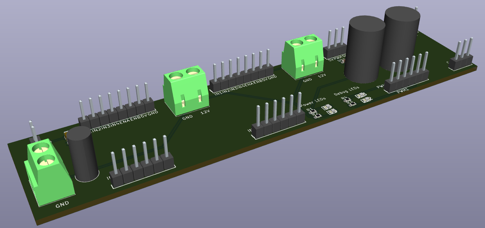
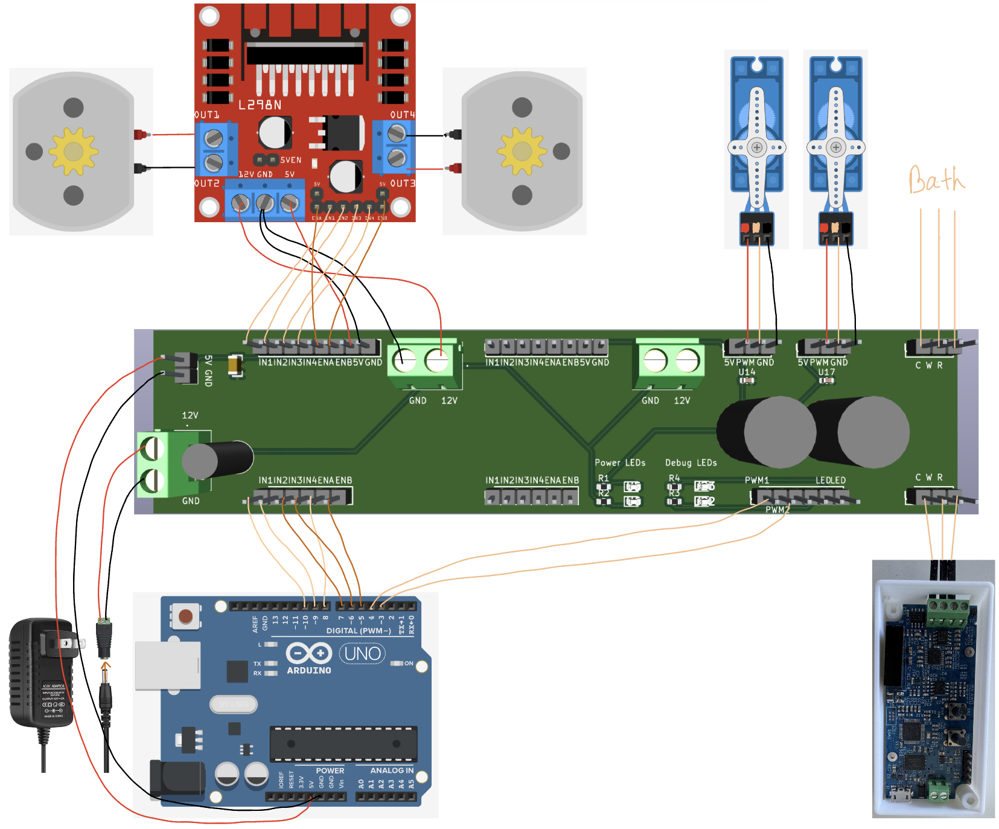

# Self‑Driving Lab Electronics

*Figure 1 – Breakout PCB, 3‑D view generated in the CAD tool.*

*Figure 2 – As‑built wiring overview of the full electronics stack.*

## General Description
The circuit controls **fluid dosing, sample manipulation, and electrochemical sensing**.  
Two **12 V dosing pumps** are driven through an **L298N dual H‑bridge module**, allowing bidirectional flow control.  
Gripping and mechanical positioning are handled by **two HS‑322HD standard servos**, commanded directly from the Arduino’s 5 V logic outputs.  
An **Arduino Uno** serves as the central controller, generating PWM signals for the pumps and servos while streaming experimental parameters to a connected computer.  
Electrochemical measurements are captured by an open‑source **potentiostat module** ([design details on ChemRxiv](https://chemrxiv.org/engage/chemrxiv/article-details/65c436f966c13817292e9bfc)), which receives experiment timing signals (PWM/trigger) from the computer and reports current/voltage data via its own USB/UART interface.  
All point‑to‑point wiring is routed through a **pass‑through breakout PCB** fitted with screw‑terminals and header strips to keep the prototyping area tidy and to simplify hot‑swapping; however, *the breakout board is strictly a convenience layer*—every interconnection shown can be wired directly between the Arduino, driver boards, and sensors without impacting functionality.

## Bill of Materials

| # | Component | Specification / Example Part No. | Qty |
|---|-----------|----------------------------------|----:|
| 1 | Arduino Uno R3 (or compatible) | ATmega328P‑based MCU board | 1 |
| 2 | L298N Dual H‑Bridge Motor Driver Module | 5 V logic, 46 V / 2 A per channel | 1 |
| 3 | 12 V DC Dosing Pump | Peristaltic / diaphragm, ≈0.3 A stall | 2 |
| 4 | Standard Servo Motor | **HS‑322HD**, 5 V supply | 2 |
| 5 | Potentiostat Board | Open‑source design (see ChemRxiv link) | 1 |
| 6 | Breakout / Routing PCB (optional) – BOM at `Electrical/elec/layout/default/production/bom.csv` | Custom 2‑layer FR‑4 with screw‑terminals | 1 |
| 7 | 12 V / 2 A DC Power Supply | Barrel‑jack or Phoenix connector | 1 |
| 8 | Jumper Wires & Dupont Leads | 22 AWG stranded | — |

*Quantities marked “—” depend on enclosure layout.*

### PCB Design Note
The breakout PCB was created with **[Atopile](https://docs.atopile.io/atopile/quickstart)**—a platform that lets you design electronics **with code**. use `sdl_breakout.ato` as the entry to the Atopile project. If you would like to directly submit the PCB files to the manufacturing, use the zip file from `/elec/layout/default/production` 

---

*Last updated: 2025‑04‑17*
