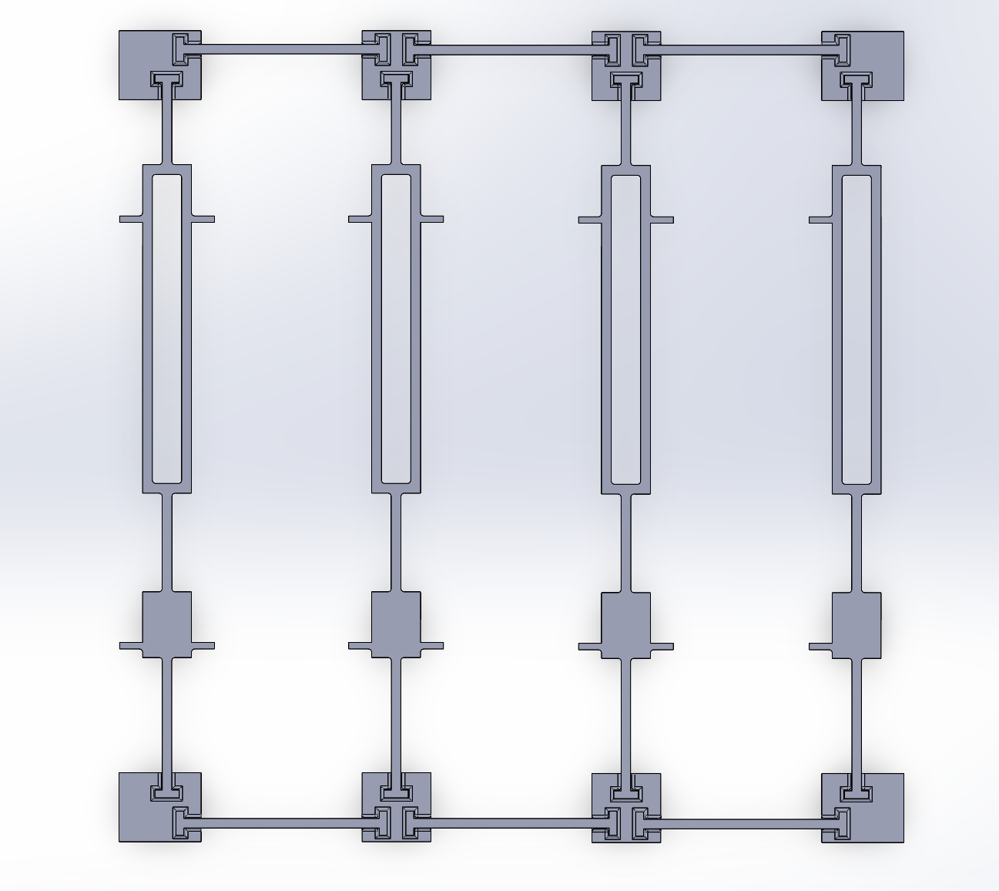
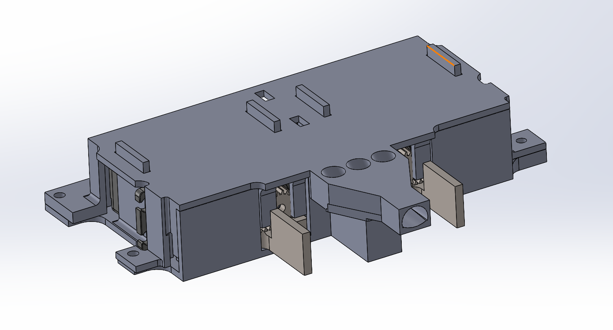
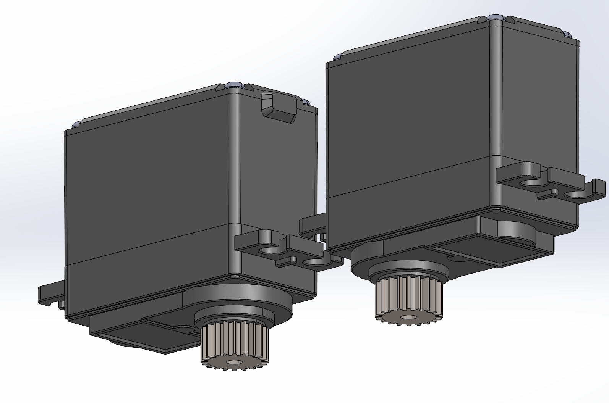
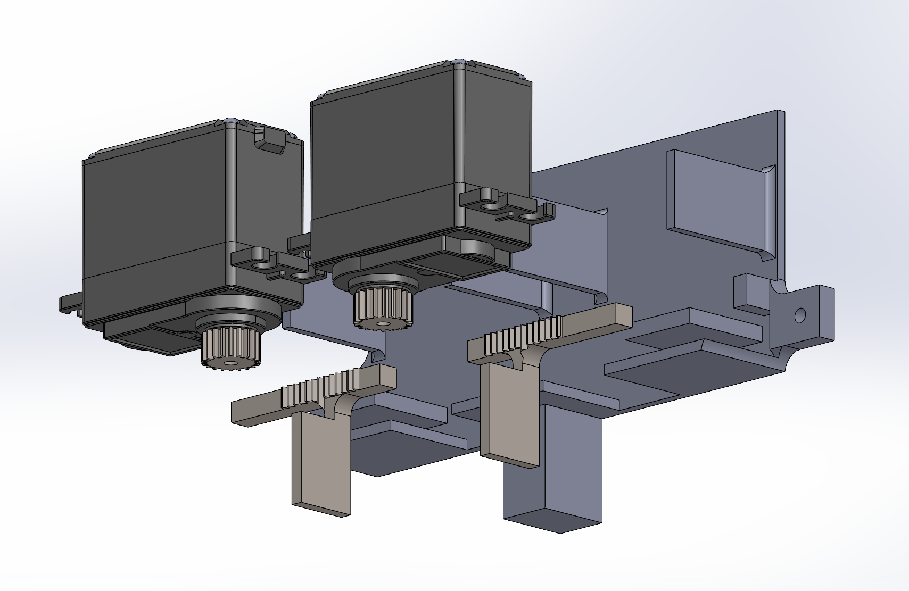
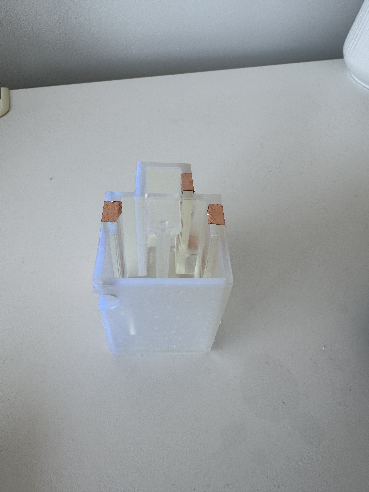
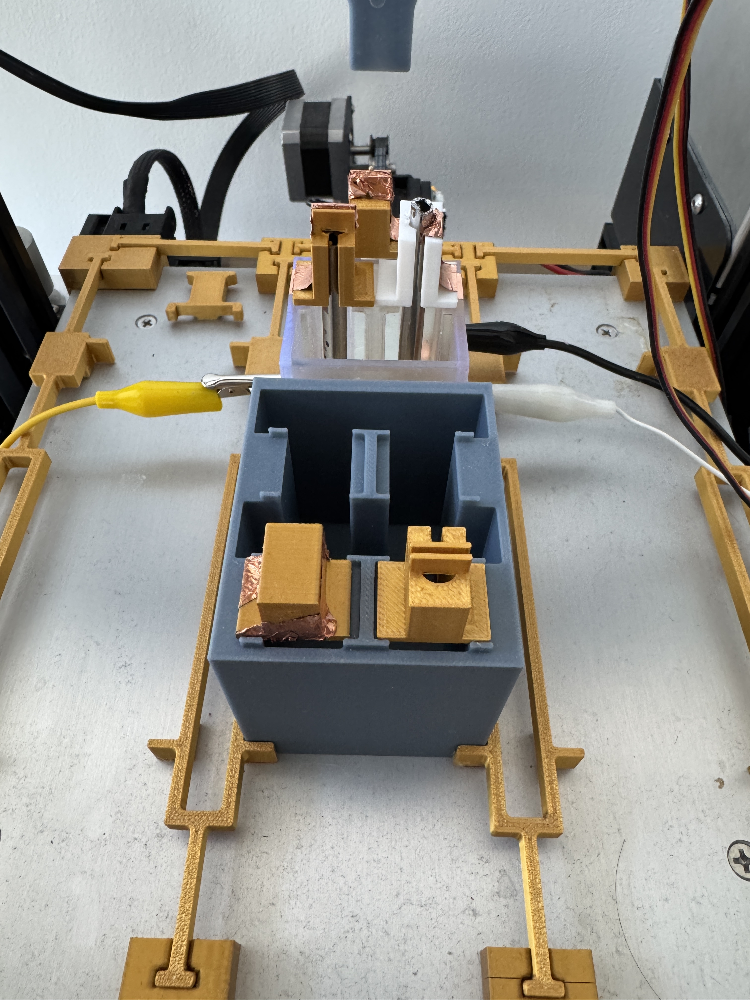

# Self‑Driving Lab Hardware Setup

## [Moving Base](#moving_base)
### Objectives
- **Multi-Axis Motion**: The system must provide precise X, Y, and Z-axis movement to position components accurately within the workspace.
- **Gripper Compatibility**: A gripper mechanism must be able to be mounted securely to manipulate electrodes of various shapes and sizes.
- **Integrated Electrolyte Delivery**: The moving head should be able to move electrolytes into the electrochemical cell as needed during experiments.

### Design
- **3D Printer Gantry Setup**: After months of experimenting, it was decided that modifying a small Ender 3 gantry would be the best base in terms of structural rigidity, precision, and repeatability while also being relatively low-costing. From the preliminary designs of the other components, the Ender 3 print bed was big enough to carry 3 sets of bath-electrode deposite setups, and the head was also big enough and had enough mounting points to potentially fit 2 gripper setups.
- **Plate Guides/Positioners**: After the design of the [Electrochemical Cell Setup](#electrochemical-cell-setup) matured, the repeatability of the setup became an issue, as slight nudges on the setup from the gripper will prevent the setup from functioning correctly due to the precise commanded movements. To prevent this, the guides were designed so that the starting position of the [Electrochemical Cell Setup](#electrochemical-cell-setup) is always known and any small misalignment that occurs during experiments can be self-corrected.

### Assembly Instructions
1. Print 2 sets of corner guide clips, 4 center guide clips, 2 2-notched guides, and 2 1-notched guides.
2. Place the corner guide clips (the pieces where the T-shaped slots are perpendicular to each other) at the corners of the print bed and the centre guide clips on the front and back edges of the plate.
3. Place the short guide sticks between the clips on the front and back edges of the plate.
4. Connect the clips on the front and back edges of the plate using the long guide sticks. Use the sticks with two notches as the middle guide sticks and the ones with one notch as the side guide sticks near the gantry bracket.

*Figure 1 – Assembled guide setup.*

## [Gripper](#gripper)
### Objectives
- **High repeatability and reliability**: The gripper can grip and ungroup two electrode holders at once repeatedly and reliably (50+ automated experiements without human assistance).
- **Small footprint**: The gripper assembly should be able to be mounted on the 3D printer gantry head. The distance between the two gripped electrode holders should be minimal.
- **Solution Deposition Integration**: The solution deposition system should be mounted near the grippers to allow for a solution to be fed into different baths to allow for possible parallel experiments.

### Design
- **Hitech HS322 motors**: A servo motor was selected since the setup required high precision. While the HS322 motors may seem slightly large for the assembly, they were selected because they are highly repeatable and output large enough torques to hold on to the electrode holders through friction reliably compared to the tested smaller motors (Tower Pro SG90).
- **Rack and Pinion Mechanism**: It was chosen as the core gripper mechanism as it allows for optimum mounting angles while also keeping the necessary gripper travel small to manoeuvre around the compact electrode handling systems.
- **Overall packaging**: The main idea behind the packaging was to place the 2 grippers as close as possible so that the sizes of other parts could be minimized. The supports on each gripper plate constrains the motor when gripping, further improving repeatibility and backlash. The funnel for multiple solution deposits was fit between the 2 rack pinion mechanisms because it was the kept all the components close.

 
*Figure 2 – Gripper assembly.*

### Assembly instructions
1. Print 2 pinion and rack gears and the 2 plates.
2. Install the pinion gears onto the motor shaft.
 
*Figure 3 – Pinion gear assembly.*
3. Place the rack gears and the motors onto the backplate.
 
*Figure 4 – Rack gear assembly.*
4. Snap the front plate over the assembly.
5. Screw the entire gripper assembly onto the gantry head.
6. Connect the solution pipes to the funnel entrance.

## [Electrochemical Cell Setup](#electrochemical-cell-setup)
### Objectives
- **Electrode Accommodation**: The cell/bath must hold a working electrode, a reference electrode, and a counter electrode, each with reliable connections to a potentiostat.
- **Liquid Handling**: The bath must allow the liquid to be deposited from the gripper mechanism and be drained cleanly by another drainage tube setup.
- **Low-volume Operation**: The setup should be designed to conduct experiments using small volumes of liquid to conserve reagents and minimize waste.

### Design
- **Electrode Holders**: To interface with the bath, the electrode holders were designed to have a shape that allows them to be easily dropped onto the bath supports. The shape also allows the electrical tape trace on the holder to have a low-resistance connection with the electrodes and the traces on the bath when the experiment is taking place.
    - A slot gap is selected for the working electrode. It becomes a tight fit for the electrode once the tape is also inserted into the gap. The tape trace is then routed to the bottom of the holder, where the bath would be supporting the electrode holder.
    - For the other electrodes, a tight/snap cylinder fit is used to support the electrode (the opening allows for some flex in the electrode holder for it to become a tight fit). The electric tape is then taped on one or either side of the slot to guarantee low-resistance contact between the electrode connector and the electric tape. The electric tape is then routed to the bottom of the electric holder, similar to the slot electrode holder, to connect with the trace on the bath side.
- **Electrode Deposite**: It is a simple design that minimizes the amount of space required to hold 4 electrodes and their holders. The extra opening between the 2 rows of electrode holders is required to accommodate the solution funnel when the gripper is lowered to pick up the electrodes. Small supports are added on top of the deposit to prevent unnecessary lateral movement of the electrode holders during gripping to improve repeatability and reliability. The outer size of the electrode deposit is also designed with the guides so that 3 experiment setups can fit on the print bed.

*Figure 5 – Electrode deposite and different electrode holders.*
- **Bath**: The bath is designed to minimize the fluid required per experiment by minimizing the footprint of the bath. The bottom of the bath is slanted towards a point that is near the centre of the bath but out of the way of all the electrodes so that the fluid can be drained cleanly by a drainage tube that is fed through the hole on the back side of the wall of the bath that is angled in a way that allows the tube to be fed to the lowest point of the bath. The 2 middle slots are for the electrodes working and reference, and the front slot is for the counter electrode. The outline and the size of the bath (the 3 slots and the hole for the liquid) also closely match the area and the outline of the electrode holders and the solution funnel to further minimize the area and the amount of liquid required. The middle support section is designed so that the part is 3D printable and out of the way of the electrodes and the drainage tube. The outer side of the bath is also designed with the guides so that 3 experiment setups can fit on the print bed. The top of the bath also has little nubs similar to the electrode deposite that further support the electrode holders. The electric tape traces are routed from the top of the bath where the electrode holder is incontact with the path to the extrude on the side of the bath. The extrudes on the outside of the bath are designed for alligator clip onto the electric tape traces.

*Figure 6 – Bath.*

### Assembly Instruction
1. Print the electrode deposites and bath (depends on how many experiements is needed to perform at the same time).
1. Route the electric tape from the electrode holder supports to the side extrudes on the bath.
2. Route the electric tape on the electrode holder from the electrode connector or the working electrode to side of the holder.
3. Place the electrode deposites and bath on the print bed as the following

*Figure 7 – Fully setup print bed.*

---

*Last updated: 2025‑04‑20*