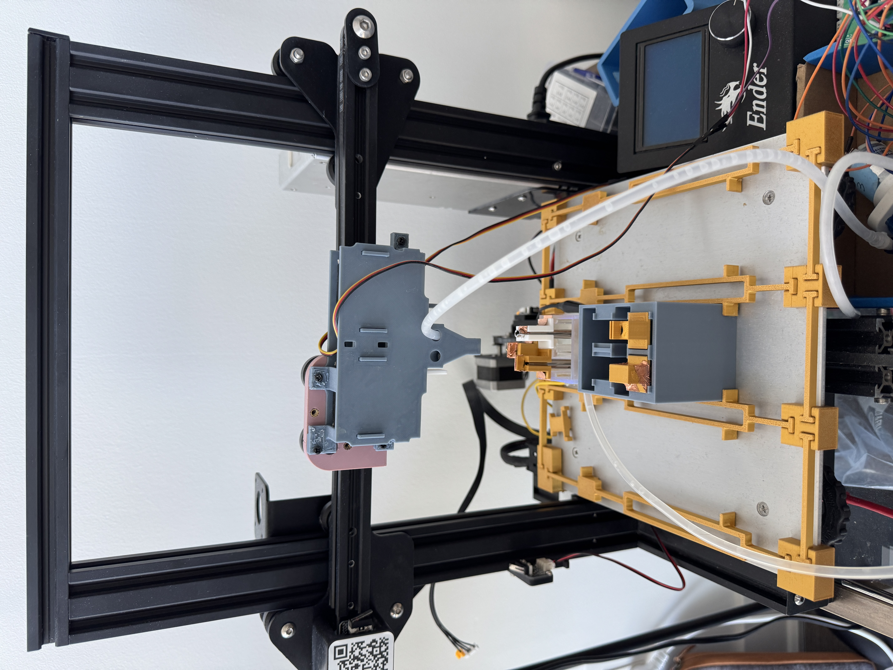

# Automated Electrochemical Testing Robot


*Figure 1: Complete setup of the electrochemical testing robot*


*Figure 2: Schematic diagram of the robot's key components (to be added)*

## Project Overview

Automated electrochemical testing system that combines a modified 3D printer with electrochemical measurement capabilities. The purpose of this robot is to enable high-throughput experimentation in electrochemical research under $400. 

The system features:
- **Hardware Components**
  - Modified 3D printer frame for automated positioning
  - 3D printed bath design and electrode holders
  - Servo-controlled grippers for electrode manipulation
  - Programmable fluid handling system with peristaltic pumps
  - Integrated potentiostat for electrochemical measurements
- **Measurement Capabilities**
  - Open Circuit Potential (OCP)
  - Linear Polarization Resistance (LPR)
  - Cyclic Voltammetry (CV)

## Getting Started

1. Set up the hardware components according to the Mechanical and Electronics documentation
2. Install the required software dependencies
3. Configure the device connections in `devices.json`
4. Run the system using the main.py Python script

## Documentation

- [Software Documentation](Software/README.md)
- [Electronics Documentation](Electrical/README.md)
- [Mechanical Documentation](Mechanical/README.md)

## Sample Data

Below is an example of the data collected by the system:

```
Sample measurement data will be displayed here
Showing voltage/current curves, measurement parameters, etc.
```


