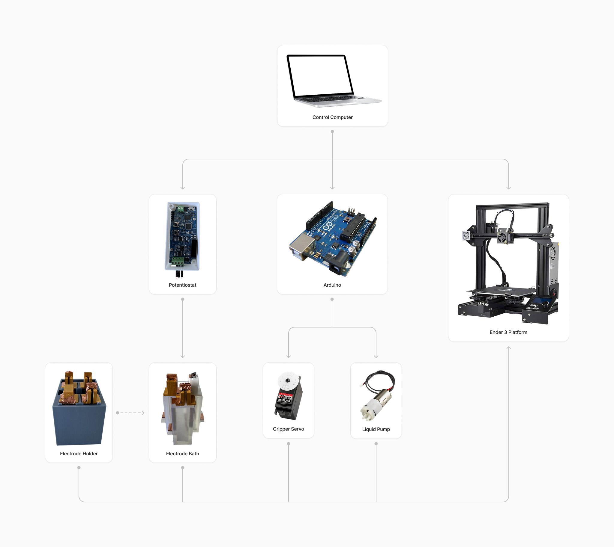
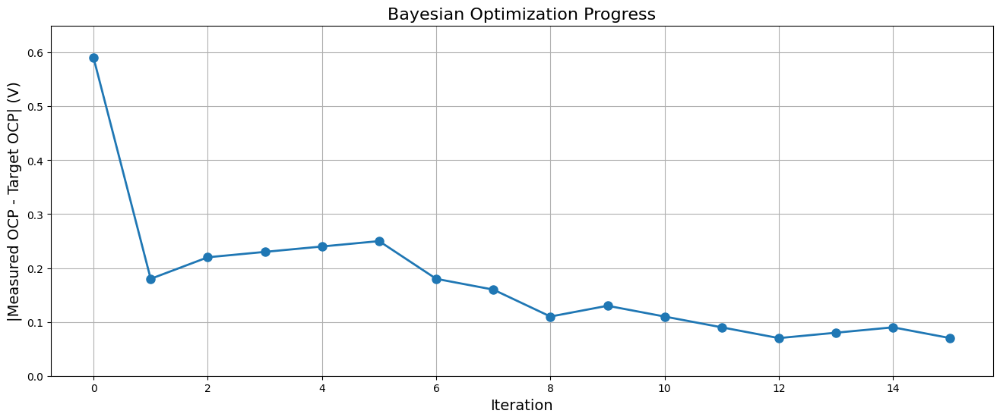
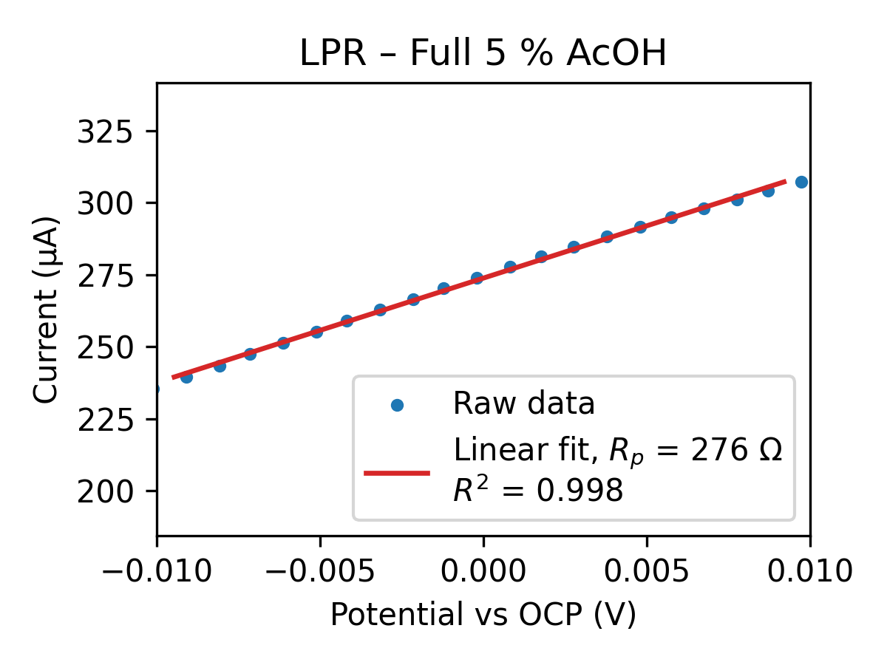
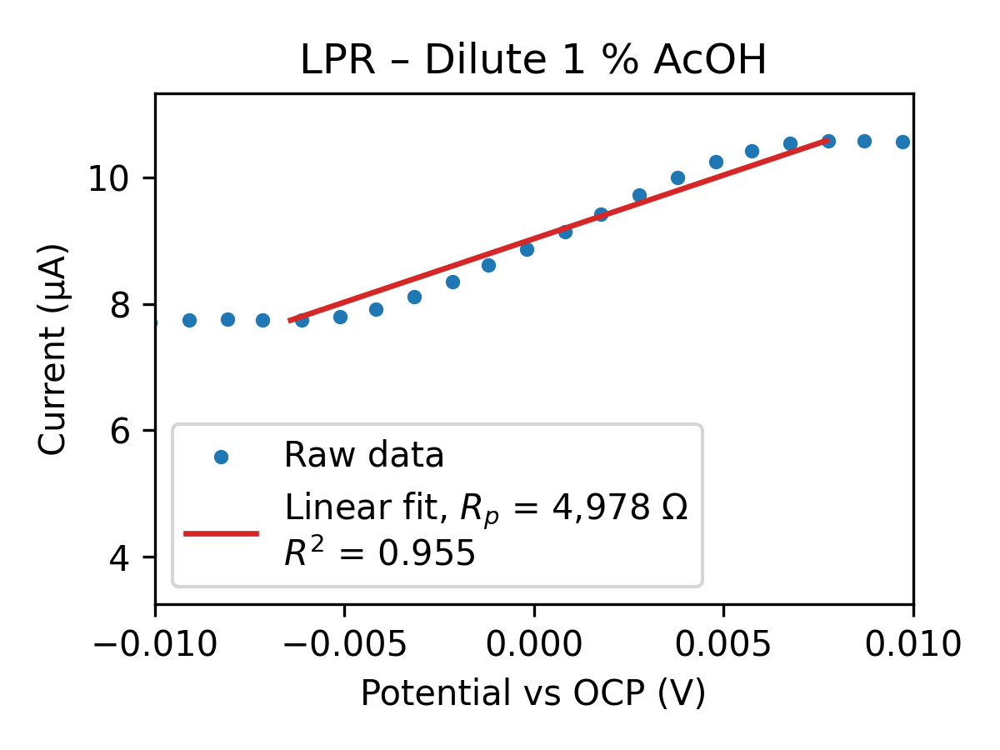
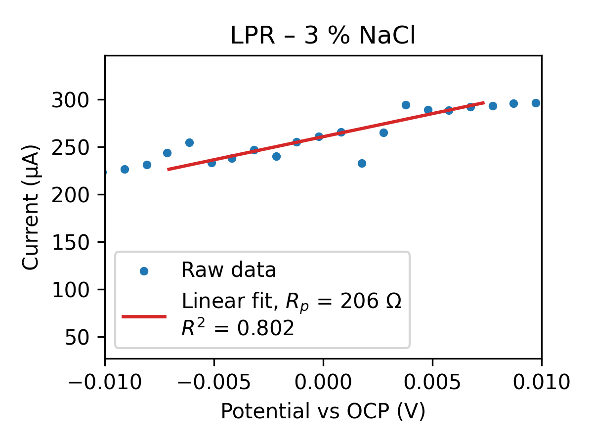
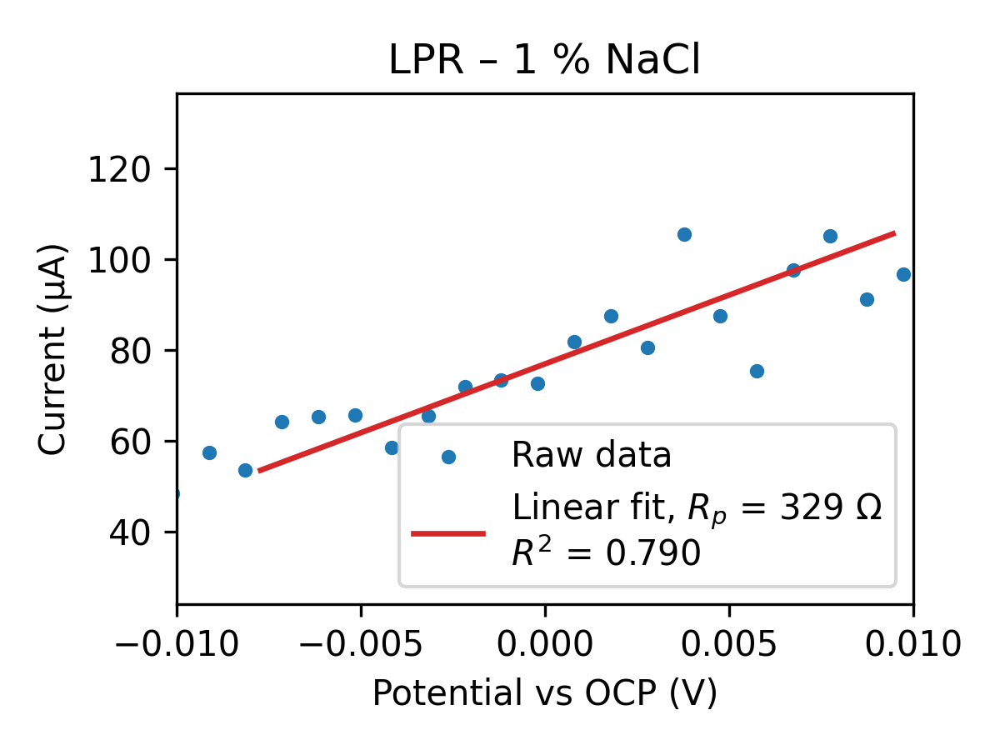

# Autonomous Open-Science Robot

*Figure 1: Complete setup of the robot*

*Figure 2: Schematic diagram of the robot's key components*

## Project Overview

Automated electrochemical testing system that combines a modified 3D printer with electrochemical measurement capabilities. The purpose of this robot is to enable high-throughput electrochemical research under $400. 

The system features:

  - Modified 3D printer frame for automated positioning
  - 3D printed bath design and electrode holders
  - Servo-controlled grippers for electrode manipulation
  - Programmable fluid handling system with peristaltic pumps
  - Integrated potentiostat for electrochemical measurements

## Getting Started

1. Set up the hardware components according to the Mechanical and Electronics documentation
2. Install the required software dependencies
3. Configure the device connections in `devices.json`
4. Run the system using the main.py Python script

## Documentation

- [Software Documentation](Software/README.md)
- [Electronics Documentation](Electrical/README.md)
- [Mechanical Documentation](Mechanical/README.md)

## Data

Examples of data collected by the system:

### Bayesian Optimization

*Figure 7: Bayesian optimization progress showing error convergence for target potential of -0.1V*

The optimization process iteratively adjusts vinegar concentration while measuring the resulting potential difference, converging on the optimal conditions with minimal experimental trials.

### Acetic Acid Solutions

*Figure 5: LPR measurement in full 5% Acetic Acid (Rp = 276 Ω)*

*Figure 6: LPR measurement in dilute 1% Acetic Acid (Rp = 4,978 Ω)*

### NaCl Solutions

*Figure 3: LPR measurement in 3% NaCl solution (Rp = 206 Ω)*

*Figure 4: LPR measurement in 1% NaCl solution (Rp = 329 Ω)*
