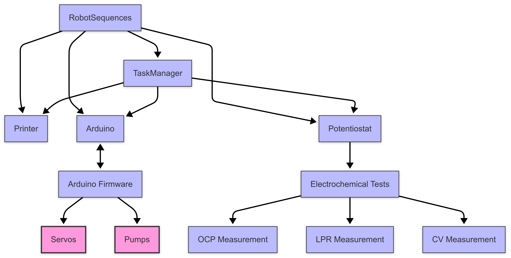

# Self-Driving Lab Software



*Figure 1 – Overview of the software stack.*

## General Description
The software system controls **electrochemical measurements, fluid dosing, and sample manipulation**.  
A **Python-based stack** handles high-level command scheduling, device communication, and data recording.  
Communication with devices happens over **serial connections** to an Arduino controller and a 3D printer's motion system.  
Electrochemical measurements are performed by an open-source **potentiostat module** which requires the [Potentiostat Interface Library](https://gitlab.com/aspuru-guzik-group/potentiostat/interface) for operation.

## Software Architecture

| Component | Description |
|-----------|-------------|
| **TaskManager** | Core scheduling system that manages sequences of operations |
| **Device Classes** | Abstract interfaces for hardware components (Printer, Arduino, Potentiostat) |
| **RobotSequences** | Higher-level robot operation sequences combining multiple hardware operations |
| **Arduino Firmware** | Controls servos and pumps, receives commands via serial JSON messages |
| **Potentiostat Integration** | Runs electrochemical measurements with external potentiostat hardware |

## Setup and Dependencies

1. Clone this repository
2. Install Python dependencies:
   ```bash
   pip install -r requirements.txt
   ```

The core dependencies include:
- `pyserial` - For serial communication with devices
- `numpy` - For numerical operations and data handling
- `pandas` - For data handling and saving
- `seaborn` - For data visualization
- `toml` - For configuration
- `requests` - For HTTP requests

## Device Configuration

Hardware connections are configured in `devices.json`:
```json
{
    "printer": {
        "port": "/dev/tty.usbmodem5CF0515B37301",
        "baudrate": 115200
    },
    "arduino": {
        "port": "/dev/tty.usbmodem112301",
        "baudrate": 9600
    },
    "potentiostat": {
        "port": "/dev/tty.usbmodem2055349133301"
    }
}
```

Adjust the port names according to your system.

## Running Experiments

Basic experiment:
```bash
python main.py
```

The system supports the following electrochemical measurements:
1. Open Circuit Potential (OCP)
2. Linear Polarization Resistance (LPR)
3. Cyclic Voltammetry (CV)

Each measurement can be configured with parameters such as:
- Duration
- Sample rate
- Scan rate
- Voltage ranges
- Data saving options

## Component Overview

### Main Control Flow
- `main.py`: Entry point for robot control
- `TaskManager.py`: Manages and executes sequences of operations
- `Task.py`: Represents individual operations with parameters
- `HelperTask.py`: Utility functions for common operations

### Device Communication
- `Arduino.py`: Interface to Arduino hardware (grippers, pumps, motors)
- `Printer.py`: Interface to 3D printer motion system
- `Device.py`: Abstract device factory and interfaces
- `Potentiostat.py`: Interface to potentiostat for electrochemical measurements

### Experiment Sequences
- `RobotSequences.py`: Contains pre-defined sequences of robot operations including:
  - Electrode manipulation (grip/ungrip)
  - Position control (move to start, move to bath)
  - Fluid handling (pump operations)
  - Complete electrochemical test sequences

### Arduino Firmware
- `Arduino/Arduino.ino`: Handles servos for gripping and pumps for liquid handling
- Processes JSON commands received via serial connection


> **DISCLAIMER**: The `pstat` folder is a fork of the following [Potentiostat Interface Library](https://gitlab.com/aspuru-guzik-group/potentiostat/interface)

